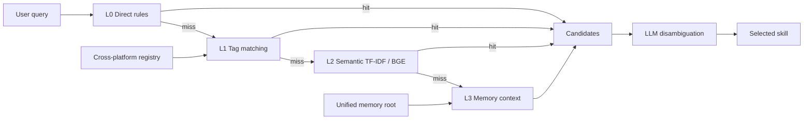

# Fenjue — Unified Memory & Skill Routing for Multiple AI Agents

> A governance framework that lets multiple AI agents (Claude Code, Codex, OpenClaw, etc.) share one memory, one skill registry, one routing evaluation, and a measurable attention budget — evolved through 145+ self-improvement iterations.

[](https://lxh113377.github.io/fenjue/)
[](https://github.com/lxh113377/fenjue/actions)
[](LICENSE)
[](https://github.com/lxh113377/fenjue)

## Measured results (2026-08)

| Metric | Value |
|--------|-------|
| Composite scorecard | 165.2 / 200 (82.6%, V2 basis, 2026-09-23) |
| Routing blind-test Top-1 | 100% (66/66 scored samples, author-measured baseline, 2026-08) |
| Cross-platform sync | 6 agents (WB / TR / CX / HM / ZC / OC) |
| Skill registry | 151 registered |
| Attention overhead (complex tasks) | 11.8K tokens (target <=12K) |
| Iterations | 145+ commits |

## Problems it solves

- **Fragmented memory**: agents maintain separate memories and never see each other's knowledge → one shared memory source via junctions, "change once, all ends sync".
- **Unreliable routing**: the more skills, the more fragmented/conflicting triggers → a 4-layer router (direct → tag → semantic → memory) with layered blind-test regression.
- **Lessons written but never used**: fingerprints + mechanical hit-rate checks + end-of-task gates.
- **Context bloat**: slower responses from loading too much → measured attention overhead and budget-constrained boot protocols.

## Six tracks

1. Cross-platform skill sync (junction + registry + sync scripts)
2. Unified memory + skill routing (single source of truth + routing tables + intent classifier)
3. Hit-rate optimization (keyword / TF-IDF / BGE / memory, blind-test regression)
4. Lessons reuse measurement (fingerprints + mechanical gates)
5. Attention optimization (token overhead, context dilution, needle-in-haystack tests)
6. Pre-use sampling measurement (skill pre-use rate sampling + statistics)

## Architecture



## Layout

| Directory | Purpose |
|-----------|---------|
| `eval/` | 4-layer routing evaluation toolchain |
| `audit/` | trigger / hit-rate / overlap audit scripts |
| `skill/` | cross-platform skill registry & sync |
| `skill_tree/` | routing index & bridge configs |
| `scripts/` | public-repo safety gate |
| `docs/` | demo page & docs |

## Quickstart

The `eval/` scripts in this repo are integrated with a unified memory root
(`<memory-root>`) and expect a full memory environment. The standalone,
parameterized toolchain with example data and tests lives in the companion
project [skill-hitrate-toolkit](https://github.com/lxh113377/skill-hitrate-toolkit):

```bash
# 1. Repo self-checks (safety gate + syntax)
python scripts/check_public_clean.py
python -m compileall -q eval audit scripts

# 2. For evaluation and routing experiments, use skill-hitrate-toolkit
git clone https://github.com/lxh113377/skill-hitrate-toolkit
cd skill-hitrate-toolkit && pip install -r requirements.txt
python eval/build_skill_vectors.py --skills-dir examples/skills --output output
python eval/skill_hitrate_eval_v2.py --skills-dir examples/skills --index-dir output
```

> `skill/registry/*.json` is a cross-platform registry (aggregated index) with a
> different schema from the toolchain's evaluation data format.

## Docs & demo


- 🌐 Live demo: https://lxh113377.github.io/fenjue/
- `docs/showcase.html` — demo page (open directly in a browser)
- Each module has its own README / architecture notes

## License

MIT
