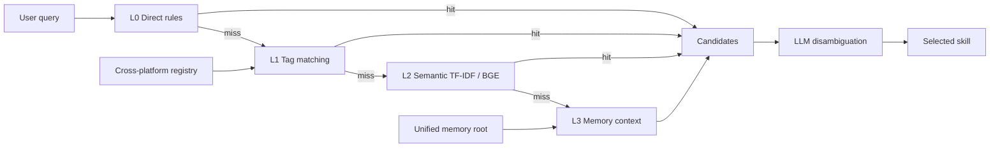

# Fenjue — Unified Memory & Skill Routing for Multiple AI Agents

> Chinese is the authoritative document (`README.md`); this file is its English counterpart and is kept
> claim-by-claim consistent with it. Every number below was produced on a clean clone of **this** repo.

[](https://github.com/lxh113377/fenjue/actions)
[](LICENSE)
[](pyproject.toml)

**This repository is the public subset.** It contains no personal memory corpus, session logs,
skill bodies or model weights. Anything that cannot be reproduced from a clean clone is not stated here.

## 30-second start

```bash
git clone https://github.com/lxh113377/fenjue.git
cd fenjue
python -m pip install -r requirements.txt

# Tiered hit-rate evaluation on synthetic skills — no network, no private corpus
python eval/hitrate_cli.py --skills-dir examples/skills --queries examples/queries.json --top 3

# Scale benchmark (index time / per-query latency / peak allocation)
python eval/bench_router.py --sizes 12,100,500,1000

# Tests
python -m pytest -q
```

None of those commands requires a path from the author's machine. The Python floor is derived from the
dependencies themselves (`numpy 2.5.2` publishes `Requires-Python >=3.12` on PyPI), not from habit.

## Install as commands (optional)

```bash
python -m pip install .
fenjue-hitrate --skills-dir examples/skills --queries examples/queries.json --top 3
fenjue-bench --sizes 12,100,500,1000
fenjue-mcp                      # stdio MCP server (needs the extra below)
```

The wheel is 592 KB and CI has a dedicated `install-face` job that installs it into a clean venv and
runs all three commands from **outside** the repository, because the source-tree face can never reveal
a packaging defect. Publishing to PyPI is **not** done (needs an account + Trusted Publishing), so the
supported story is "install from source", never `pip install fenjue`.

## Optional: expose the router to an agent over MCP

```bash
python -m pip install "mcp>=2.2,<3"
python eval/mcp_server.py          # stdio; tools: route_skill / list_skills / hitrate_report
```

Point your agent's MCP config at that command and the routing layer becomes a callable tool instead of
something you shell out to and then parse stdout of. `FENJUE_SKILLS_DIR` / `FENJUE_QUERIES_FILE` select
the data face; both default to the synthetic examples in this repo.

## Problems it solves

- **Fragmented memory**: agents keep separate memories and never see each other's knowledge →
  one shared memory root, change once and every active frontend reads the same truth.
- **Unreliable routing**: more skills means more colliding trigger words → a 4-layer router
  (direct → tag → semantic → memory) where each layer can be evaluated on its own.
- **Lessons written but never used**: fingerprints + mechanical hit checks + an end-of-task gate,
  so "we learned it" is a reading, not a promise.
- **Docs drifting from reality**: hardcoded counts get caught. `eval/doc_claim_face.py` (this subset)
  compares every endpoint count appearing in the shipped prose against the single truth source
  `eval/truth_constants.json`; the source repo does the wider job with `eval/verify_truth_consistency.py`.

## Measured results

Reproduce them with the commands above; do not quote these numbers without re-running them.

| Claim | How to recompute |
|---|---|
| Endpoint count | length of `endpoints.active` in `eval/truth_constants.json` — the gate reads it live, so no count is duplicated in prose |
| Tiered hit rate | `python eval/hitrate_cli.py --skills-dir examples/skills --queries examples/queries.json --top 3` |
| Scale behaviour | `python eval/bench_router.py --sizes 12,100,500,1000` |
| Test suite | `python -m pytest -q` |

Machine reading taken 2026-09-29 on a clean clone (Python 3.12.2 / Windows-AMD64, after warming the
sklearn lazy imports and taking the median of three passes): 1000 synthetic skills ⇒ index 0.0446 s,
per-query p95 0.107 ms, peak allocation 6.5 MB. The bundled example set gives Top-1 10/14 and Top-3 12/14
(easy 5/5, medium 3/4, hard 2/5).

## Architecture



## Layout

| Directory | Purpose |
|-----------|---------|
| `eval/` | routing evaluation, gates, and the public entrypoints (`hitrate_cli.py`, `bench_router.py`, `mcp_server.py`) |
| `eval/tests/` | tests for everything shipped here; excluded modules and reasons in `eval/tests/EXCLUDED.md` |
| `audit/` | trigger collision / overlap / attention-tax audits |
| `skill/registry/` | cross-platform registry JSON (derived artifact) |
| `examples/` | synthetic skills in two layouts: flat `*.md` and `<name>/SKILL.md` |
| `scripts/` | public-repo safety gate and helper scripts |
| `docs/` | per-frontend install notes and the demo page |

## Skill formats it reads

`--skills-dir` accepts both the flat layout used by `examples/skills` and the **Agent Skills**
directory layout (`<skill-name>/SKILL.md`, as published by anthropics/skills), so a third-party skill
tree can be evaluated without translating it first. See `examples/agent-skills/` — that set is a format
demonstration (three deliberately non-overlapping skills), so its hit-rate reading carries no quality signal.

## Known limits

- The BGE semantic layer and the L3 memory layer are **not** in this subset (182 MB weights / private
  memory root), so only the TF-IDF-equivalent scoring is exercised here.
- PyPI publication is **not** done (needs an account and Trusted Publishing). `pip install .` works and
  is re-verified on every push by the CI `install-face` job, but `pip install fenjue` is not yet a true
  statement. Debt register: `docs/DEBT_UNWIRED.md` (L-4).
- `ruff` reports findings on this face and is therefore **not** wired into CI yet; a permanently red
  gate teaches the next person to comment it out.

## Docs & demo

- `docs/showcase.html` — demo page, open it directly in a browser. No hosted deployment exists for this
  repo; an earlier revision of this file linked a GitHub Pages URL that measures 404, removed 2026-09-29.
- `docs/INSTALL.md` plus per-frontend notes; `llms.txt` for machine readers; `THIRD-PARTY-NOTICES.md` for licences.
- Contribution discipline: `CONTRIBUTING.md`. Vulnerability definitions: `SECURITY.md`.
  Version history: `CHANGELOG.md`. Judges present-but-unwired, each with its measured exit code and the
  precondition to wire it: `docs/DEBT_UNWIRED.md`.

## License

MIT, see `LICENSE`.
