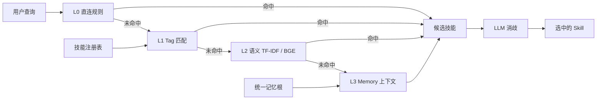

# 记忆焚诀 Fenjue — 多 Agent 统一记忆与技能路由治理系统

> 一句话：把「AI 编码助手会不会记、会不会查、会不会用教训」做成**可度量**的工程——
> 四层路由、真相源一致性门禁、命中率分层盲测，每条主张都有测试和机器读数，不靠感觉。

[](https://github.com/lxh113377/fenjue/actions/workflows/ci.yml)
[](LICENSE)
[](pyproject.toml)

**本仓库是对外子集。** 它不含作者的个人记忆语料、会话日志、技能正文或模型权重。
仓内所有数字都是**在干净 clone 面上实跑**得出的；跑不出来的一律不写。
源仓（私有治理档案）的规模与差异见文末「与源仓的关系」。

---

## 30 秒上手

```bash
git clone https://github.com/lxh113377/fenjue.git
cd fenjue
python -m pip install -r requirements.txt

# 命中率评估：合成数据集，零外部依赖、零网络
python eval/hitrate_cli.py --skills-dir examples/skills --queries examples/queries.json --top 3

# 规模基准：12 到 1000 个技能的建索引耗时与单查询延迟
python eval/bench_router.py --sizes 12,100,500,1000

# 装成命令面（可选，二选一即可）
python -m pip install .
fenjue-hitrate --skills-dir examples/skills --queries examples/queries.json --top 3
fenjue-bench --sizes 12,100,500,1000

# 测试（需 dev 依赖：pyproject 的 addopts 带 --timeout，由 pytest-timeout 提供）
python -m pip install -r requirements-dev.txt
python -m pytest
```

上面每条命令都不需要作者本机的任何路径。

> **Python 版本下限是 3.12**，不是随手写的：依赖钉了 `numpy==2.5.2`，
> 而它在 PyPI 上的 `requires_python` 实测为 `>=3.12`。首版 CI 声明 3.11 因此装不上依赖直接判红——
> 版本口径必须由依赖反推，不能由习惯填写。

---

## 解决什么问题

装了 160+ 个技能之后，编码助手最常见的四种失效，以及本仓的对策：

| 失效 | 本仓对策 | 载体 |
|---|---|---|
| **路由失准**：技能越多，触发词越互相踩 | 四层路由（直连 → Tag → 语义 → Memory），逐层可单独评估 | `eval/unified_router.py`、`eval/tfidf_router.py` |
| **教训记了不用**：踩过的坑写进日志就再没被读 | 把「用上教训」做成机械判定 + 收尾门禁，不靠自觉 | `eval/lessons_pread_audit.py`、`eval/pre_commit_hooks.py` |
| **文档与现状脱节**：README 写死「六端 / 47 例」，改一处忘三处 | 常量单源 + 派生件重建 + 一致性门禁，写死数字会被判红 | `eval/truth_constants.json`、`eval/verify_truth_consistency.py` |
| **多端各记各的**：同一知识在 N 个助手脑子里长歪 | 单一权威根 + 共享挂载 + 镜像双写校验 | `skill/registry/`、`scripts/noise_lint.py` |

## 架构



## 目录结构

| 目录 | 内容 |
|---|---|
| `eval/` | 路由与门禁主体：四层路由、真相源校验、闸的闸、状态聚合，以及三个对外入口 `hitrate_cli.py` / `bench_router.py` / `mcp_server.py` |
| `eval/tests/` | 77 个测试模块；未随包分发的模块及其原因见 `eval/tests/EXCLUDED.md` |
| `audit/` | 触发词冲突、语义重叠、注意力税模拟等审计脚本 |
| `scripts/` | 外发内容安全门禁、噪声治理、钩子安装 |
| `skill/registry/` | 跨端技能注册表（JSON，派生件） |
| `examples/` | 12 件**合成**技能 + 14 条分层查询（扁平 `*.md`）；另有 `agent-skills/` 用标准 `<name>/SKILL.md` 布局放了 15 件合成技能与 34 条查询（触发词**故意**互相撞车，见下面第 5 节），用于零环境跑通评估链 |
| `docs/` | 各端安装册与演示页 |

## 示例用法

### 1. 命中率评估（本仓的主打可跑面）

```bash
python eval/hitrate_cli.py --skills-dir examples/skills \
  --queries examples/queries.json --top 3 --show-cases
```

实测输出（2026-09-29，Python 3.12）：

```
技能 12 个 / 查询 14 条 / Top-N=3
层级        样本   Top-1    Top-1率     Top-N率
easy         5       5     100.0%     100.0%
medium       4       3      75.0%     100.0%
hard         5       2      40.0%      60.0%
合计        14      10      71.4%      85.7%
```

**为什么按难度分层**：把「明确关键词」和「口语化歧义」混成一个总数，
任何命中率都能被调得好看。hard 层只有 40%，这就是它的真实水平，不合并上报。

### 2. 外发内容安全门禁（可演习）

```bash
python scripts/public_clean_check.py --selftest   # 双向自证：干净须绿；注入已知泄露串须红
python scripts/public_clean_check.py              # 扫全树；缺身份配置时报 partial，不报 pass
```

实测：`[GATE:clean-selftest-pass] 正向 0 命中/1 文件；反例命中 1 处（探针模式 api_key_shape）`。

这把闸是**重写版**。上一版把学号、姓名、私人代理域名用字符串拼接藏在门禁脚本自己里，
于是它扫不到自己、恒判 CLEAN——一个查隐私的门禁对作者本人的泄露失明，
比没有门禁更糟，因为它给出虚假的安全感。

### 3. 规模基准（技能库变大以后还跑得动吗）

```bash
python eval/bench_router.py --sizes 12,100,500,1000
```

实测输出（2026-09-29，Python 3.12.2 / Windows-AMD64；先预热把 sklearn 的惰性首趟
挤出计时，再取 3 趟中位）：

```
技能数     查询数      建索引(s)        单查询中位(ms)          单查询p95(ms)      峰值内存(MB)      抽查
12      20       0.0021        0.0017             0.0033          0.229         ok
100     20       0.0064        0.0075             0.012           0.869         ok
500     20       0.0246        0.0302             0.0421          3.34          ok
1000    20       0.0446        0.0633             0.1069          6.465         ok
```

不预热的后果写在文件头：同一进程里第一趟恒约 6.2s，把它记进「12 个技能」那一行，
公布的就是一个由取数顺序决定的数字。**抽查列**判的是「Top-1 的词对 == 查询词对」，
规模涨了但检索无效的基准没有意义。

### 4. 让 agent 直接调（MCP，可选依赖）

```bash
python -m pip install "mcp>=2.2,<3"
python eval/mcp_server.py
```

stdio 传输，三个工具：`route_skill` / `list_skills` / `hitrate_report`；取数面由
`FENJUE_SKILLS_DIR`、`FENJUE_QUERIES_FILE` 指定，默认指向仓内合成示例。
协议面不是"文件在场"就算数：`eval/tests/test_mcp_server.py::TestStdioHandshake`
起真子进程走 `initialize → tools/list → tools/call` 全握手，并断言工具回包里
有实际打分结果。没装 `mcp` 时该组判 **SKIP 且写明缺什么**，不判 PASS。

### 5. 技能格式互通

`--skills-dir` 同时吃两种布局：本仓示例的扁平 `*.md`，和 Agent Skills 标准目录
`<name>/SKILL.md`（anthropics/skills 用的那种）。第三方技能树不必先翻译成我们的形状：

```bash
python eval/hitrate_cli.py --skills-dir examples/agent-skills/skills \
  --queries examples/agent-skills/queries.json --top 3
```

这一面在 2026-09-29 轮173 之前只有 3 件互不重叠的技能，跑出来恒 100%——那**不是**成绩，
是语料没有判别力。现在 15 件技能的触发词故意撞车（`日志` 同属分诊与归档、`数据` 同属清洗与同步、
`构建` 同属镜像与流水线…），撞车面由测试 `test_standard_corpus_can_discriminate` 钉住
（共用触发词少于 3 个即判红，防后人把它退化成「怎么排都对」的假语料）。

本轮实测（复算＝`python eval/hitrate_cli.py --skills-dir examples/agent-skills/skills --queries examples/agent-skills/queries.json --top 3`）：

| 档 | 样本 | Top-1 | Top-3 |
|---|---|---|---|
| easy | 14 | 92.9% | 100.0% |
| medium | 5 | 80.0% | 80.0% |
| hard | 15 | 53.3% | 80.0% |
| 合计 | 34 | **73.5%** | **88.2%** |

hard 档 53.3% 是这张表里最有用的一个数：它说明语料真能问到路由器答不出的地方。
分数本身随分词器与权重变，改一处必然撞红 `eval/tests/test_hitrate_cli.py` 的锁数腿（有意如此）。

### 6. 统一入口与一条命令自检

```bash
python eval/fenjue_cli.py --version            # 装好后同样： fenjue --version
python eval/fenjue_cli.py route "这条 SQL 很慢，帮我看看索引" --top 3
python eval/fenjue_cli.py doctor               # 把随包自检串跑一遍，逐条给 rc（项数 = `CHECKS` 长度，不在散文里写死）
python eval/fenjue_cli.py mcp-config --client claude    # 生成可直接粘贴的接入配置（codex 出 TOML）
```

`doctor` 的三条边界是行为写死的，不是文案：**载体不在场 ⇒ 记「跳过 + 原因」不算通过**；
**一项都没跑 ⇒ rc=2**（零检查不等于全绿）；**任一条红 ⇒ rc=1 且点名那一条**。
版本是单源的：`--version` 读分布元数据（装了）或 `pyproject.toml`（源码树），
两处都能读到而不等就报 `DRIFT` 并 rc=2——本仓刚被自己的判据抓过一次"同一事实存两份"，
所以 `eval/__init__.py` 里刻意不再放第二份 `__version__` 常量。

实际使用案例（含每组的复算命令与被判据抓出的真缺陷）在 **`docs/CASE_STUDY.md`**。

## 测试说明

```bash
python -m pip install -r requirements-dev.txt
python -m pytest
```

干净 clone 面实测。**同一份提交在两个面上用例数本来就不等，所以两面分开写**：

- CI 面（Linux runner，与本页 `ci` run `36566463375` 同一次跑批，2026-09-29 20:12 +08 从 run 日志取）：`669 passed, 58 skipped`，rc=0
  复算＝`gh run view 36566463375 --log | grep -oE "[0-9]+ passed, [0-9]+ skipped in .*"`；
  这一行**刻意不带「本机/Windows」这类面标记**，所以它就是 CI 上被 `README face parity` 步（`eval/doc_claim_face.py` 族[pytest汇总]）拿同一次跑批对账的那一行——上一版把它改成「不写死」，代价是这一族在 CI 上变成没有内容可比的对账面，判据在场却咬不到东西
- 本机面（Windows + Python 3.12.2，2026-09-29 18:0x，按 `requirements.txt` + `requirements-dev.txt` 精确 pin 装出来的隔离 venv）：`669 passed, 49 skipped`，rc=0

本机面覆盖 77 个测试模块 / 739 条用例。跳过项是需要外部重资产（真实 CI 状态、模型权重）的用例。

第一行由 CI 的 `README face parity` 步与**同一次跑批**的汇总行对账（`eval/doc_claim_face.py`
族[pytest汇总]），写歪 CI 就红；第二行带「本机」面标记，CI 拿 Linux 读数去比它属于逼供，
所以判据显式豁免它并把这个豁免**计数打印出来**（豁免数不印＝静默放行）。
上一版这里只写一个不带面的汇总值（664/48），而当天下午两个面各自实跑是 655/49 与 654/58——
三个数没有一个还活着，这就是「只写一个数、不写面」的下场。

> 别在命令行再补一个 `-q`：`pyproject.toml` 的 `addopts` 已含 `-q`，
> 叠加成 `-qq` 会把上面这行汇总整行压掉，你就只剩一串点了。

⚠️ **这句必须带面**：同一份提交在「只装 `requirements.txt` 的环境」实测一度是 **3 条红**
（`ModuleNotFoundError: No module named 'flask'`，来自随包分发的 `feedback/app.py`），
而作者本机面是 0 红——因为本机全局 site-packages 里本来就有 flask。
把「不写哪一面」的读数登进交付文档，等于把可复现性主张建立在评委装不出来的环境上。
现两处都收：flask 归入运行依赖（它是随包模块的 import 面），`requirements-dev.txt` 改为
引用运行依赖而不是把同一个 pin 再抄一遍。

同一提交在 **CI 面（Linux）与本机面（Windows）的用例数本来就不相等**：差的是平台专属用例
（`scripts/*.ps1` 与计划任务那批，实测一轮差 10 条）。所以这里只写规则不写死两个面的数——
两边各自的汇总行随时可取：本机 `python -m pytest` 末行，CI 侧
`gh run view <run-id> --log | grep -oE "[0-9]+ passed, [0-9]+ skipped in .*"`。
覆盖率同理：Linux 面比 Windows 面低约 2pp（本轮 32% 对 34.07%），CI 地板按 **Linux 面**定
（`--cov-fail-under=28`），不按开发机定。

另有 20 个测试模块**没有**随本子集分发，因为它们断言的是作者本机的真仓状态、
私有技能根或 182 MB 模型权重——在对外子集里必然测不到东西。处置是
**具名摘除并登记原因**（`eval/tests/EXCLUDED.md`），而不是放宽断言：
放宽等于造一把恒绿的尺子，比不测更坏。

### CI 抓到两条本地测不出的缺陷

这两条都是「我在本机验了绿，但本机不是评委的环境」，正是 CI 存在的理由：

1. `requirements.txt` 钉 `numpy==2.5.2`，其 PyPI `requires_python` 实测 `>=3.12`，
   而 CI 声明 3.11 ⇒ 依赖装不上，`Install runtime deps` 判红（run 36463774744）。
2. `pyproject.toml` 的 `addopts` 带 `--timeout=120`，该参数由 `pytest-timeout` 提供，
   而 CI 只装了 `pytest` ⇒ `error: unrecognized arguments: --timeout=120`，退出码 4。
   修法不是删参数，而是补 `requirements-dev.txt` 让依赖闭包完整。

## 实际使用案例

作者本人用这套结构驱动 7 个编码助手端共用一套记忆与技能库。
三个可对外复算的观察：

1. **门禁真的会红**：源仓 `eval/verify_truth_consistency.py` 当前实测
   `32 PASS / 1 FAIL / 1 SKIP`，红因是派生件里的技能计数落后于注册表（165 vs 167）。
   门禁报的是真问题，不是摆设。
2. **判据自带反例**：新增判据必须补隔离桩，否则 `eval/gate_stub_runner.py` 判红。
3. **写死数字会被抓**：本 README 早期版本写死「六端 / 196 条注册 / 147.2 分」，
   后全部随迭代漂移成假信息。因此本版**只写可当场复算的数字**，其余指向派生产物。

## 未完成功能与已知限制

| 项 | 状态 | 影响 |
|---|---|---|
| BGE 语义层 | 未随包分发（182 MB ONNX 权重） | 本包只跑 TF-IDF 语义层；四层中的 L2-BGE 与 L3-Memory 在对外子集不可用 |
| 生产路由器端到端可跑 | 需私有记忆根 | `eval/unified_router.py` 在场但需真实注册表；对外面只保证 `hitrate_cli.py` 可跑 |
| hard 层命中率 | 40%（5 条中 2 条 Top-1） | 未做同义扩展与查询改写，是下一步 |
| **公开面可跑的评测集占比** | **14 / 291 条 ≈ 4.8%**。仓内 `eval/layered_testset.json` 有 291 条分层查询（skills 151／cli 59／short 51／fault_finding 19／negative 11），但它的 121 个 `expected_skill` 全是**源仓技能名**，与 `examples/skills` 的 12 个合成技能交集为 **0** ⇒ 主评测集在本包内跑不动，对外只报得出上面那 14 条 | 这是「未实现功能须注明占比」里最容易漏的一格：文件随包分发看着像能跑。复算＝`python -c "import json,os;d=json.load(open('eval/layered_testset.json',encoding='utf-8'));exp={q.get('expected_skill') for t in d for q in t['queries']};pub={os.path.splitext(f)[0] for f in os.listdir('examples/skills')};print(sum(len(t['queries']) for t in d),len(exp),len(exp&pub))"` |
| 49 条跳过用例（2026-09-29 复算，上一版写 48） | 需外部重资产 / 真实 CI | 不构成功能缺失，但这部分行为在本包内未被验证 |
| Windows 专属工具链 | `scripts/*.ps1` 与计划任务脚本 | 非 Windows 不可用；CI 只覆盖 Linux |
| `pip install .` | **支持**（轮166 起：补 `[build-system]` + `packages=["eval"]` + 三条入口点） | wheel 体积**不在本文件写死**（它随每次加模块变，写一次就错一次；2026-09-29 实测 598,827 B 是时点值）；复算＝`python -m pip wheel --no-deps -w <dir> .` 后取产物字节数，该面由 CI 的 `install-face` job 每次 push 复验。装进干净 venv 后 `fenjue-hitrate` / `fenjue-bench` / `fenjue-mcp` 三条命令**在仓外**跑出读数（`fenjue` 这第四条入口点在场但未进该复验名册，故不并列主张）。未做＝发布到 PyPI（需账号与 Trusted Publishing，见 `docs/DEBT_UNWIRED.md` 的 L-4）⇒ 对外只说「从源码安装」，禁写 `pip install fenjue` |
| ruff 未接全仓面 | 复算＝`python -m pip install "ruff==0.16.5" && python -m ruff check . \| tail -2`；2026-09-29 实测 **122 处（97 处可自动修）**，上一版写 88/69 已过期——lint 计数必须同时写尺子版本，否则「88→122」到底是回归还是换了把尺无法归因 | 接进去而不清完 = 给下一个贡献者造一把必红的尺子；清完再接 |

## 文档

- 各端安装册：`docs/INSTALL.md` 与 `docs/INSTALL-{wb,hm,cx,zc}.md`
- 面向 LLM 的站点摘要：`llms.txt`
- 第三方依赖与许可：`THIRD-PARTY-NOTICES.md`
- 未随包分发的测试模块：`eval/tests/EXCLUDED.md`
- 在线演示：https://lxh113377.github.io/fenjue/ （由 `pages.yml` 把 `docs/` 发成 Pages；
  2026-09-29 04:2x 本机复测 **HTTP 200／2,699 B**。同一地址在 03:5x 实测是 404（那时 Pages 还没建站），
  所以这条带时刻而不是写成永久事实——可达性按「域名×时刻」报，禁止引用无时刻的旧读数）
- 贡献与并发工作纪律：`CONTRIBUTING.md`；漏洞定义与报告口径：`SECURITY.md`
- 版本变更账：`CHANGELOG.md`；**在场但未接线的判据清单**（逐条带实测 rc 与接线前提）：`docs/DEBT_UNWIRED.md`

## 与源仓的关系

| 面 | 源仓（私有治理档案） | 本仓（对外子集） |
|---|---|---|
| 跟踪文件 | 913（2026-09-29 时点值，源仓面，**clone 本仓复算不出**） | 433（复算＝`git ls-files \| wc -l`；上一版写 431，差的是 `eval/command_face_parity.py` 与它的测试件） |
| 测试模块 / 用例 | 90 / 982（同上，源仓面） | 75 / 718。数法：70 继承自源仓 ＋ 5 个公开面新增（`test_hitrate_cli`/`test_bench_router`/`test_fenjue_cli`/`test_mcp_server`/`test_command_face_parity`）＝75；另有 20 个源仓模块具名摘除，见 `eval/tests/EXCLUDED.md`。上一版这里写「74 / 704」——与本文件「目录」行同源，被 `doc_claim_face.py` 族[测试模块] 在新增那一次当场判红 |
| 机器综合评分 | 149.6 / 200（74.8%，Codex 判定未达标） | 不适用（评分卡依赖私有语料） |
| 内容 | 含会话日志、个人记忆、技能正文、模型权重 | 全部剔除；示例数据为合成 |

本仓由源仓**已提交 SHA 的 `git archive`** 单向生成（脱敏 818 处机器路径与身份串）。
切了哪些面、为什么切、替换成什么，全部写成仓内可核验的声明：见 `PUBLIC-SUBSET.md`。
刻意不从工作树拷贝——源仓常有并发会话在写，工作树不是可信取料面。

## 许可

MIT，见 `LICENSE`。
