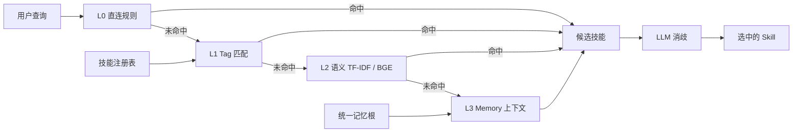

# 记忆焚诀 Fenjue — 多 Agent 统一记忆与技能路由治理系统

> 一句话：把「AI 编码助手会不会记、会不会查、会不会用教训」做成**可度量**的工程——
> 四层路由、真相源一致性门禁、命中率分层盲测，每条主张都有测试和机器读数，不靠感觉。

[](https://github.com/lxh113377/fenjue/actions/workflows/ci.yml)
[](LICENSE)
[](pyproject.toml)

**本仓库是对外子集。** 它不含作者的个人记忆语料、会话日志、技能正文或模型权重。
仓内所有数字都是**在干净 clone 面上实跑**得出的；跑不出来的一律不写。
源仓（私有治理档案）的规模与差异见文末「与源仓的关系」。

---

## 30 秒上手

```bash
git clone https://github.com/lxh113377/fenjue.git
cd fenjue
python -m pip install -r requirements.txt

# 命中率评估：合成数据集，零外部依赖、零网络
python eval/hitrate_cli.py --skills-dir examples/skills --queries examples/queries.json --top 3

# 测试
python -m pytest -q
```

上面三条命令都不需要作者本机的任何路径。

---

## 解决什么问题

装了 160+ 个技能之后，编码助手最常见的四种失效，以及本仓的对策：

| 失效 | 本仓对策 | 载体 |
|---|---|---|
| **路由失准**：技能越多，触发词越互相踩 | 四层路由（直连 → Tag → 语义 → Memory），逐层可单独评估 | `eval/unified_router.py`、`eval/tfidf_router.py` |
| **教训记了不用**：踩过的坑写进日志就再没被读 | 把「用上教训」做成机械判定 + 收尾门禁，不靠自觉 | `eval/lessons_pread_audit.py`、`eval/pre_commit_hooks.py` |
| **文档与现状脱节**：README 写死「六端 / 47 例」，改一处忘三处 | 常量单源 + 派生件重建 + 一致性门禁，写死数字会被判红 | `eval/truth_constants.json`、`eval/verify_truth_consistency.py` |
| **多端各记各的**：同一知识在 N 个助手脑子里长歪 | 单一权威根 + 共享挂载 + 镜像双写校验 | `skill/registry/`、`scripts/noise_lint.py` |

## 架构



## 目录结构

| 目录 | 内容 |
|---|---|
| `eval/` | 路由与门禁主体：四层路由、真相源校验、闸的闸、状态聚合，以及 `hitrate_cli.py` |
| `eval/tests/` | 70 个测试模块；未随包分发的模块及其原因见 `eval/tests/EXCLUDED.md` |
| `audit/` | 触发词冲突、语义重叠、注意力税模拟等审计脚本 |
| `scripts/` | 外发内容安全门禁、噪声治理、钩子安装 |
| `skill/registry/` | 跨端技能注册表（JSON，派生件） |
| `examples/` | 12 个**合成**技能 + 14 条分层查询，用于零环境跑通评估链 |
| `docs/` | 各端安装册与演示页 |

## 示例用法

### 1. 命中率评估（本仓的主打可跑面）

```bash
python eval/hitrate_cli.py --skills-dir examples/skills \
  --queries examples/queries.json --top 3 --show-cases
```

实测输出（2026-09-29，Python 3.12）：

```
技能 12 个 / 查询 14 条 / Top-N=3
层级        样本   Top-1    Top-1率     Top-N率
easy         5       5     100.0%     100.0%
medium       4       3      75.0%     100.0%
hard         5       2      40.0%      60.0%
合计        14      10      71.4%      85.7%
```

**为什么按难度分层**：把「明确关键词」和「口语化歧义」混成一个总数，
任何命中率都能被调得好看。hard 层只有 40%，这就是它的真实水平，不合并上报。

### 2. 外发内容安全门禁（可演习）

```bash
python scripts/public_clean_check.py --selftest   # 双向自证：干净须绿；注入已知泄露串须红
python scripts/public_clean_check.py              # 扫全树；缺身份配置时报 partial，不报 pass
```

实测：`[GATE:clean-selftest-pass] 正向 0 命中/1 文件；反例命中 1 处（探针模式 api_key_shape）`。

这把闸是**重写版**。上一版把学号、姓名、私人代理域名用字符串拼接藏在门禁脚本自己里，
于是它扫不到自己、恒判 CLEAN——一个查隐私的门禁对作者本人的泄露失明，
比没有门禁更糟，因为它给出虚假的安全感。

## 测试说明

```bash
python -m pytest -q
```

干净 clone 面实测（2026-09-29）：**674 条用例 / 626 通过 / 48 跳过 / 0 失败，rc=0**，
覆盖 70 个测试模块。跳过项是需要外部重资产（真实 CI 状态、模型权重）的用例。

另有 20 个测试模块**没有**随本子集分发，因为它们断言的是作者本机的真仓状态、
私有技能根或 182 MB 模型权重——在对外子集里必然测不到东西。处置是
**具名摘除并登记原因**（`eval/tests/EXCLUDED.md`），而不是放宽断言：
放宽等于造一把恒绿的尺子，比不测更坏。

## 实际使用案例

作者本人用这套结构驱动 7 个编码助手端共用一套记忆与技能库。
三个可对外复算的观察：

1. **门禁真的会红**：源仓 `eval/verify_truth_consistency.py` 当前实测
   `32 PASS / 1 FAIL / 1 SKIP`，红因是派生件里的技能计数落后于注册表（165 vs 167）。
   门禁报的是真问题，不是摆设。
2. **判据自带反例**：新增判据必须补隔离桩，否则 `eval/gate_stub_runner.py` 判红。
3. **写死数字会被抓**：本 README 早期版本写死「六端 / 196 条注册 / 147.2 分」，
   后全部随迭代漂移成假信息。因此本版**只写可当场复算的数字**，其余指向派生产物。

## 未完成功能与已知限制

| 项 | 状态 | 影响 |
|---|---|---|
| BGE 语义层 | 未随包分发（182 MB ONNX 权重） | 本包只跑 TF-IDF 语义层；四层中的 L2-BGE 与 L3-Memory 在对外子集不可用 |
| 生产路由器端到端可跑 | 需私有记忆根 | `eval/unified_router.py` 在场但需真实注册表；对外面只保证 `hitrate_cli.py` 可跑 |
| hard 层命中率 | 40%（5 条中 2 条 Top-1） | 未做同义扩展与查询改写，是下一步 |
| 48 条跳过用例 | 需外部重资产 / 真实 CI | 不构成功能缺失，但这部分行为在本包内未被验证 |
| Windows 专属工具链 | `scripts/*.ps1` 与计划任务脚本 | 非 Windows 不可用；CI 只覆盖 Linux |

## 文档

- 各端安装册：`docs/INSTALL.md` 与 `docs/INSTALL-{wb,hm,cx,zc}.md`
- 面向 LLM 的站点摘要：`llms.txt`
- 第三方依赖与许可：`THIRD-PARTY-NOTICES.md`
- 未随包分发的测试模块：`eval/tests/EXCLUDED.md`
- 贡献与并发工作纪律：`CONTRIBUTING.md`；漏洞定义与报告口径：`SECURITY.md`

## 与源仓的关系

| 面 | 源仓（私有治理档案） | 本仓（对外子集） |
|---|---|---|
| 跟踪文件 | 913 | 402 |
| 测试模块 / 用例 | 90 / 982 | 70 / 674 |
| 机器综合评分 | 149.6 / 200（74.8%，Codex 判定未达标） | 不适用（评分卡依赖私有语料） |
| 内容 | 含会话日志、个人记忆、技能正文、模型权重 | 全部剔除；示例数据为合成 |

本仓由源仓**已提交 SHA 的 `git archive`** 单向生成（脱敏 818 处机器路径与身份串）。
切了哪些面、为什么切、替换成什么，全部写成仓内可核验的声明：见 `PUBLIC-SUBSET.md`。
刻意不从工作树拷贝——源仓常有并发会话在写，工作树不是可信取料面。

## 许可

MIT，见 `LICENSE`。
